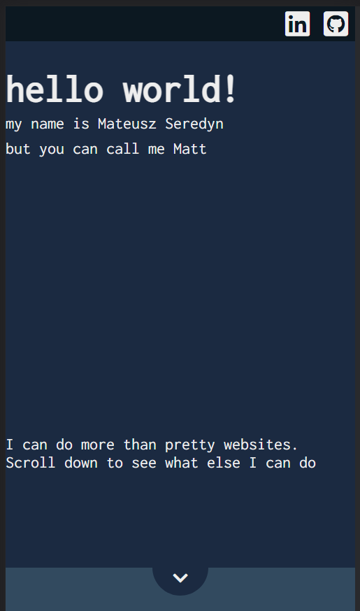

# A Web Portfolio
### By Mateusz Seredyn
 

About
=====
A **mobile first** web portfolio designed and developed by myself. 
 The site has been developed and written in 3 languages:
* HTML
* CSS (SCSS)
* JavaScript

The styling was developed off an origin concept made on [figma](https://www.figma.com/file/PIcxeYnBP6m66XKdis36IE/Portfolio_design_1?node-id=0%3A1).

 

Credits
=======

Font visible on the site is the Open Source, Google Font: `Inconsolata`.
 Available from [Google Fonts](https://fonts.google.com/specimen/Inconsolata) or [Github](github.com/googlefonts/inconsolata)
  
All Icons on the site originate from [font Awesome]()

 
 

Screenshots
===========
*Mobile View* 

 *Desktop View* 

